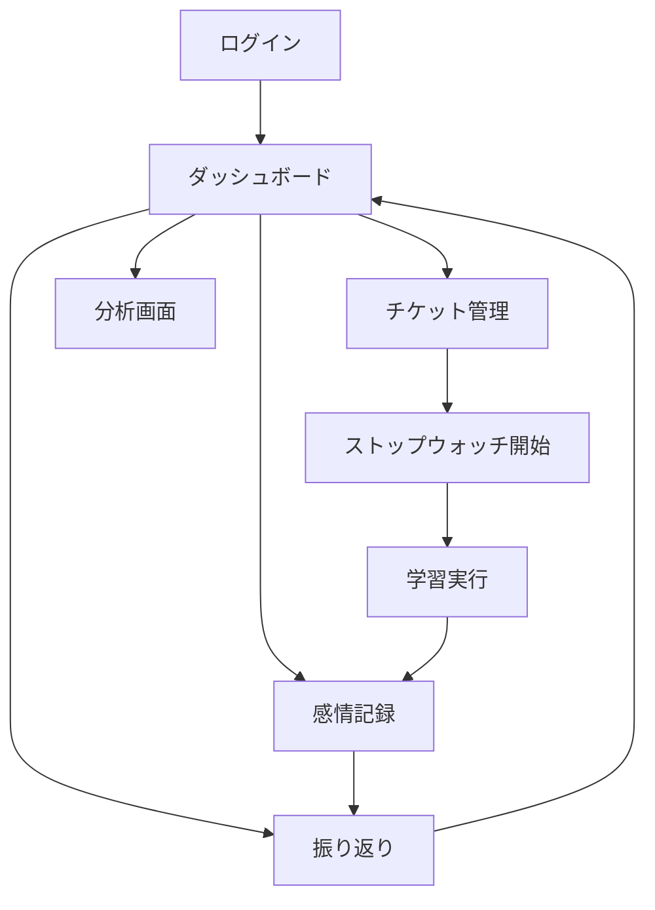

# 🧠 RDD_for_MVP（要求駆動開発）：学習支援アプリ「知的な伴走者」

## 🎯 1. MVP要求定義（Requirements）

### 1.1 ユーザー要求（MVP版）

| ユーザー | 要求内容 |
|---------|---------|
| 学習者 | 学習タスクを管理し、感情を記録し、簡単な振り返りで成長を実感したい |

### 1.2 システム要求（MVP版）

| 要求 | 内容 |
|-----|------|
| チケット管理 | 学習タスクをチケットとして作成・完了・時間記録ができる |
| 感情記録 | 学習前後の気分と集中度を簡単に記録できる |
| 振り返り機能 | シンプルな日報で学習を振り返ることができる |
| データ可視化 | 学習時間と感情の推移を基本的なグラフで確認できる |

---

## 🧩 2. MVP機能一覧（Features）

### 🎯 核心機能（Must Have）

#### 📋 チケット管理
- ✅ チケット作成（タイトル・説明・予定時間）
- ✅ チケット一覧表示・ステータス管理（未着手/進行中/完了）
- ✅ ストップウォッチ機能（実際の学習時間記録）
- ✅ 基本的な進捗表示

#### 🧠 感情記録
- ✅ 学習前後の気分記録（😄😊😐😔😩 5段階絵文字）
- ✅ 集中度記録（1-5のスライダー）
- ✅ 学習環境記録（自宅/図書館/カフェ など選択式）

#### 📝 振り返り
- ✅ シンプルな日報（今日の学び・気づき・明日への目標）
- ✅ 振り返り履歴表示

#### 📊 基本可視化
- ✅ 学習時間の棒グラフ（日別・週別）
- ✅ 感情・集中度の推移線グラフ
- ✅ 基本統計（総学習時間・平均集中度など）

### 🚫 MVP対象外機能

- 目標階層管理
- 作戦名ジェネレーター
- 教師支援機能
- ゲーミフィケーション
- 高度な分析・相関分析
- 通知・アラート機能

---

## 🏗️ 3. MVP技術構成

### 3.1 バックエンド（Django）

```
learning_companion_mvp/
├── config/              # プロジェクト設定
├── accounts/            # 基本認証のみ
├── tickets/             # チケット管理
├── emotions/            # 感情記録
├── journal/             # 振り返り
└── core/                # 共通ユーティリティ
```

#### 主要パッケージ
- `Django==5.1.4`
- `django-ninja==1.4.3`
- `psycopg[binary]==3.2.3`
- `django-redis==5.4.0`
- `python-decouple==3.8`

### 3.2 フロントエンド（Next.js）

```
frontend/
├── components/          # 再利用コンポーネント
│   ├── tickets/        # チケット関連
│   ├── emotions/       # 感情記録関連
│   ├── journal/        # 振り返り関連
│   └── charts/         # グラフ関連
├── pages/              # 画面
│   ├── dashboard/      # ダッシュボード
│   ├── tickets/        # チケット管理
│   ├── emotions/       # 感情記録
│   ├── journal/        # 振り返り
│   └── analytics/      # 分析画面
└── hooks/              # カスタムフック
```

#### 主要パッケージ
- `Next.js 14`
- `React 18`
- `TypeScript 5.6.3`
- `TailwindCSS 3.4.14`
- `Recharts 2.12.7`
- `SWR 2.2.5`

---

## 📱 4. MVP画面構成

### 4.1 画面一覧

| 画面名 | 主要機能 | 優先度 |
|--------|----------|--------|
| **ダッシュボード** | 今日のチケット一覧・学習時間サマリー・簡単なグラフ | 🔥 High |
| **チケット管理** | チケット作成・編集・時間計測・ステータス更新 | 🔥 High |
| **感情記録** | 学習前後の気分・集中度・環境入力 | 🔥 High |
| **振り返り** | 日報入力・振り返り履歴表示 | 🔥 High |
| **分析画面** | 学習時間・感情推移グラフ表示 | 🟡 Medium |

### 4.2 画面フロー



---

## 🧪 5. 検証項目

### 5.1 検証したい仮説

| 仮説 | 検証方法 | 成功指標 |
|------|----------|----------|
| ユーザーは感情記録を継続できるか | 感情記録の継続日数を測定 | 80%のユーザーが7日以上継続 |
| チケット駆動の学習は効果的か | チケット完了率・学習時間を測定 | チケット完了率60%以上 |
| 振り返り機能は学習意欲を向上させるか | 振り返り記入率・学習継続を測定 | 振り返り記入率50%以上 |

### 5.2 収集するデータ

#### 定量データ
- チケット作成数・完了率
- 感情記録の継続日数
- 振り返り記入率
- 平均セッション時間
- DAU（日間アクティブユーザー）

#### 定性データ
- UI/UXの使いやすさ
- 継続したくなるか
- 学習効果を実感できるか
- 改善要望

---

## ⚡ 6. MVP開発計画

### Phase 1（2週間）：コア機能
- [ ] 基本認証システム
- [ ] チケットCRUD
- [ ] ストップウォッチ機能
- [ ] 最小限のダッシュボード

### Phase 2（1週間）：記録機能
- [ ] 感情記録機能
- [ ] 基本的なグラフ表示（Recharts）
- [ ] データ永続化

### Phase 3（1週間）：分析・改善
- [ ] 振り返り機能
- [ ] 分析画面の充実
- [ ] UI/UX改善

### Phase 4（1週間）：検証・調整
- [ ] ユーザーテスト
- [ ] フィードバック収集
- [ ] バグ修正・調整

---

## 🎯 7. MVP成功定義

### 最小成功基準
- 3名以上のテストユーザーが1週間継続利用
- チケット機能・感情記録・振り返りの基本フローが動作
- 重大なバグがない

### 理想的成功基準
- 5名以上のテストユーザーが2週間継続利用
- 感情記録継続率80%以上
- ポジティブなフィードバックが過半数

---

## 📈 8. MVP後の発展計画

### 次期バージョンで追加検討
1. **目標管理機能**（階層化）
2. **ゲーミフィケーション**（称号・ストーリー）
3. **教師支援機能**
4. **高度な分析**（相関分析・AI提案）
5. **通知・リマインダー機能**

MVPの検証結果を基に、フル機能版の優先順位を決定し、段階的に機能を追加していく方針とします。